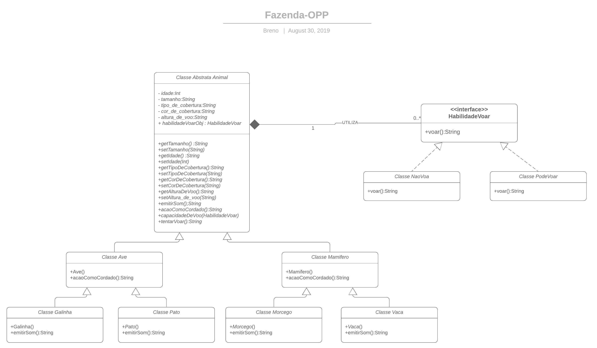

# Fazenda-POO
Teste de orientação a objeto.

### Como executar:
1. Necessário java instalado.
2. Baixe a pasta _/exec_ e execute o arquivo **exec_fazenda**.

### Como foi desenvolvido:
Foi construída uma estrutura de herança com classes abstratas que atendesse ao polimorfismo dos animais, para que isso fosse possível a habilidade de Voar foi construida como uma interface com duas implementações. 
A habilidade de voar é instanciada dentro da classe animal, como pode ser visto no diagrama abaixo:

